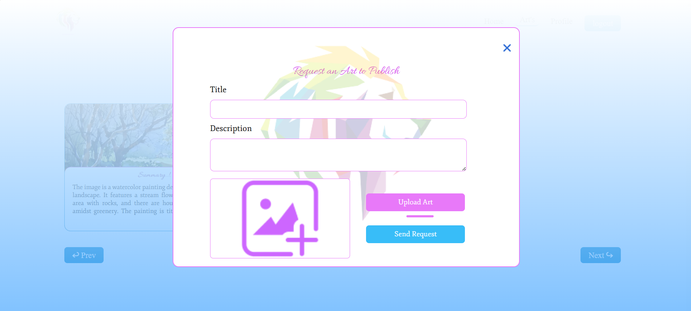

<h3>🎨 Exhibitor</h3>
This project is a creative digital platform that allows users to publish their artwork, share the story behind it, and engage with a social feed. Built with the MERN stack, <b>Exhibitor</b> provides an interactive space for artists to showcase their work and interact with their audience. Key features include:  

🖼️ **Artwork publication** with a story or description 
💬 **Social feed** to engage with artwork through likes and comments 
🌠**Responsive design** for seamless experience on both desktop and mobile 
👥 **Community interaction** to foster creativity and feedback 
🔒 **User authentication** for secure access
 
<b>🚀 Tech Stack</b> 
<b>Frontend:</b> React, Tailwind CSS 
<b>Backend:</b> Node.js, Express.js 
<b>Database:</b> MongoDB (Mongoose) 
<b>Authentication:</b> JWT (JSON Web Tokens) 
<b>Notification:</b> Brevo (Emails) 
 

<b>🖼️ Screenshots</b>

1. **Landing Page**
     
     
     
     
   
2. **Home page**
   
3. **Artwork Submission**
   
4. **Artwork Detail View**
   
   
5. **Artwork Control**
   
6. **Admin panel**
   
   
   

 
